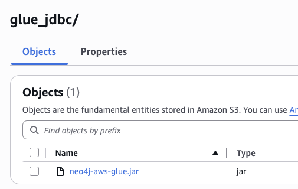
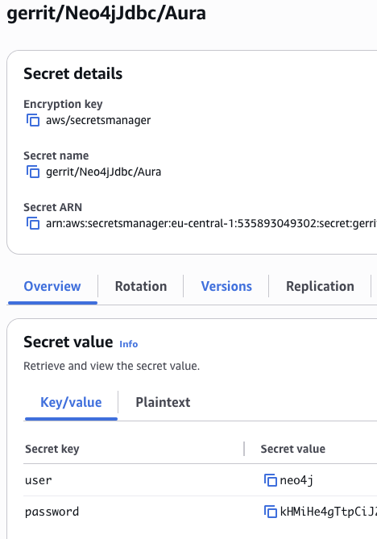
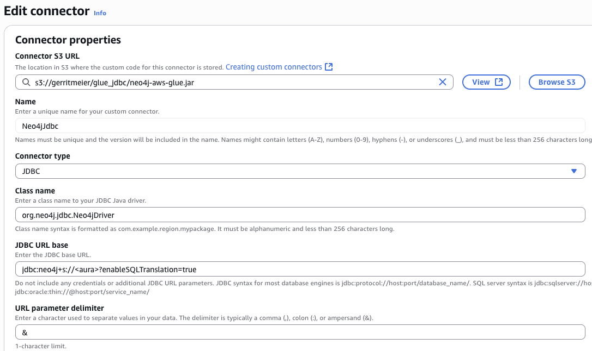
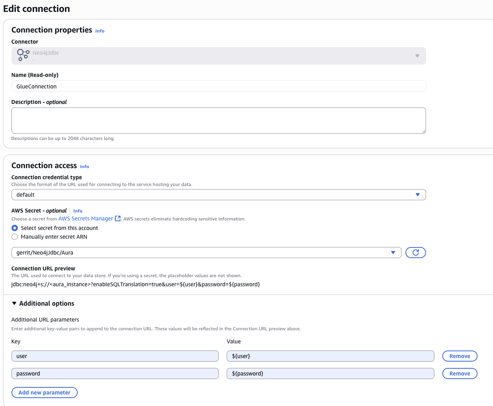
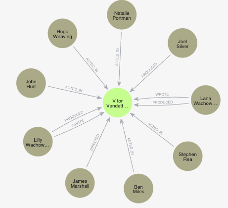
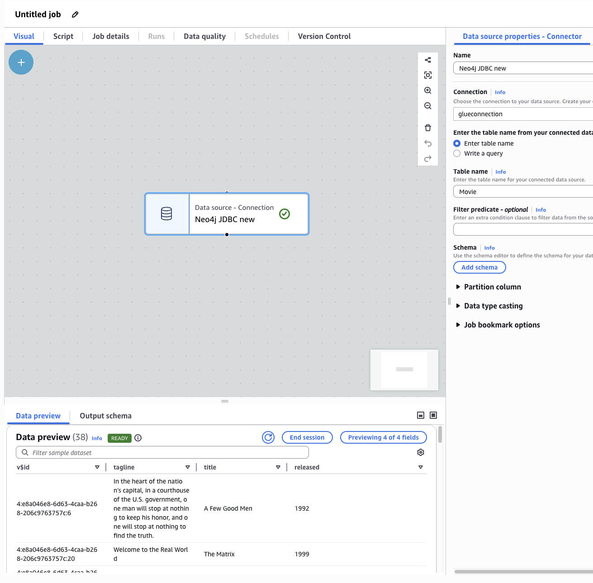
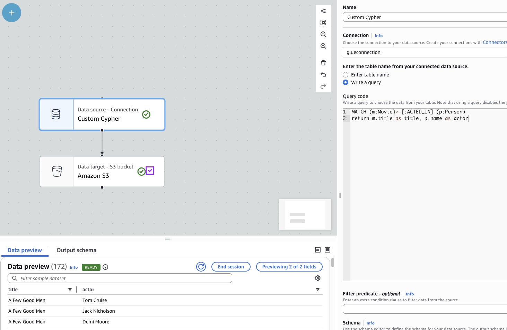
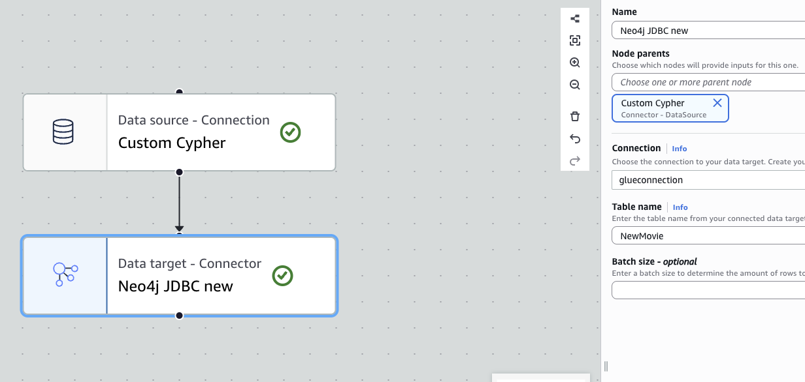
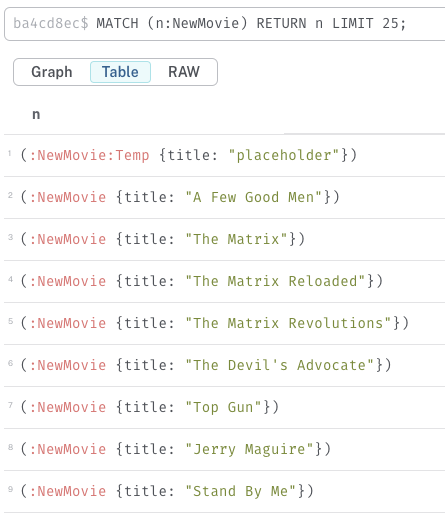

# Neo4j JDBC Driver for AWS Glue

## Preface

The JDBC driver for AWS Glue is the original Neo4j JDBC driver with an additional translator module that rewrites some SQL queries generated by AWS Glue to be compatible with the expected SQL-support in the driver.
It’s not a patched but a rebundled version and only adds a translator implementation to the releases.
As this, it depends on the Neo4j JDBC driver and can benefit from all improvements from it when updating the upstream version.

Everything that is doable with the JDBC driver, can also be done within Glue as long as the environment allows it. The complete documentation of the Neo4j JDBC driver can be found here https://neo4j.com/docs/jdbc-manual/current/

## Usage in AWS Glue

### Preparations

To make the driver work in AWS Glue it needs to be stored in a S3 bucket.

The username and password to connect to the Neo4j instance should be stored in a Secrets Manager.
The connection creation will later refer to this secret.

### Creating a connector

To make use of the JDBC driver, a connector needs to be created in AWS Glue.
After linking the driver from a S3 bucket, the Class name of the driver has to be set to `org.neo4j.jdbc.Neo4jJdbcDriver`. 
Please ensure that the _enableSQLTranslation_ feature is set to true in the connection URL.
This will enable that built-in translator feature in the JDBC driver and translate them into Cypher eventually.
For the connection creation, it is required to set the URL parameter delimiter to `&`.

### Creating a connection

With the connector prepared, a connection can be derived.
It is important to refer here to the AWS Secrets Manager to pull in the credentials provided before.
The names of the keys user and password are important because those properties will be used for the actual connection.

### ETL workload

When creating the first workload from the connection panel, the Neo4jJDBC will already be pulled into the flow as a “Data source”.
After adding the target table name the preview data can be seen in the logs.

For this guide the movie example graph was used.

The data can now be used with a Data source element pointing to the just created connection. 
The easiest way is to define a table to load the data from. 
A table here corresponds to a label in the Neo4j JDBC Driver.
Label / table (and also relationship) names can be configured in the connection uri by using the following properties: https://neo4j.com/docs/jdbc-manual/current/sql2cypher/#s2c_configuration

It’s also possible to provide custom Cypher to retrieve the values.

### Writing data back to Neo4j

It’s also possible to use the created connection as a target to write to.
As for the reads, the Neo4j JDBC Driver with its SQL translator will take care about generating the corresponding Cypher queries.

#### Writing to non-existent labels / properties

When starting naively exporting data to a label that is not in the Neo4j database, the runtime will yield an “Glue ETL Marketplace: table does not exist.” error.
This will also happen if the target properties don’t exist.  

To work around this problem a placeholder / blueprint schema needs to be created in the database first, like `CREATE (m:NewMovie:Temp{title:'placeholder'})`.
With this in place, the export will run as expected and create the nodes.

### A note on relationships

It’s not possible to create relationships with the Neo4j JDBC driver when using Neo4j as the target.
This is a general limitation that cannot be solved via the Glue / the driver because there is no way to express a relationship creation via SQL.
For this, a custom write query would have to be written in Glue which seems not possible with the visual ETL at least.

## Building

As mentioned in the introduction, this module does not contain much but only adds another Neo4j JDBC driver translator to the classpath.
Then it repackages the Neo4j JDBC driver with this translator.
To build this component, use `mvn clean package`.
This will result in a `neo4j-aws-glue-<version>.jar` that can be used as the driver jar for AWS Glue.